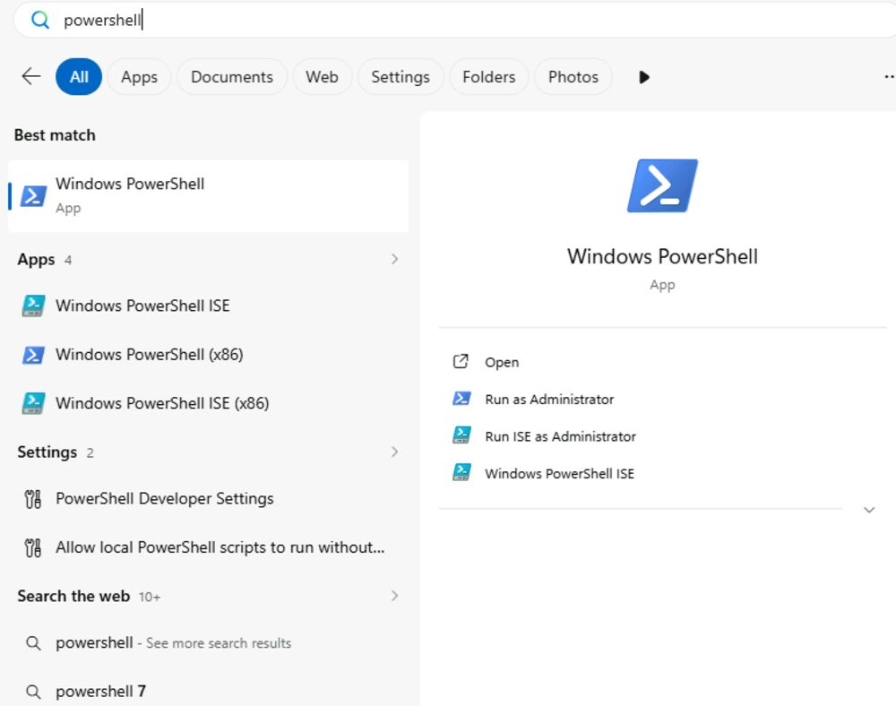
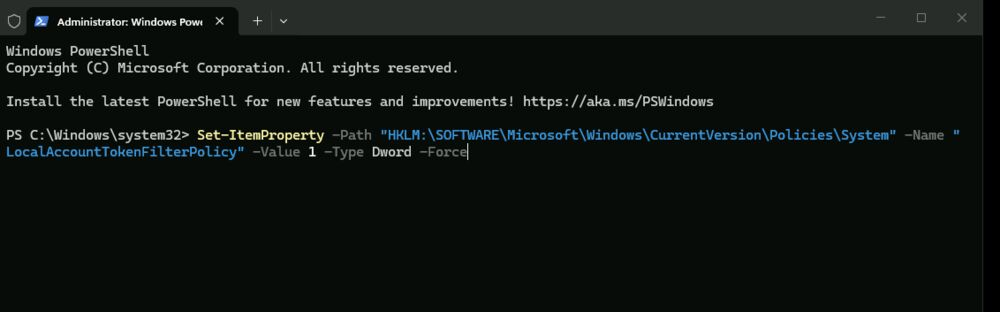
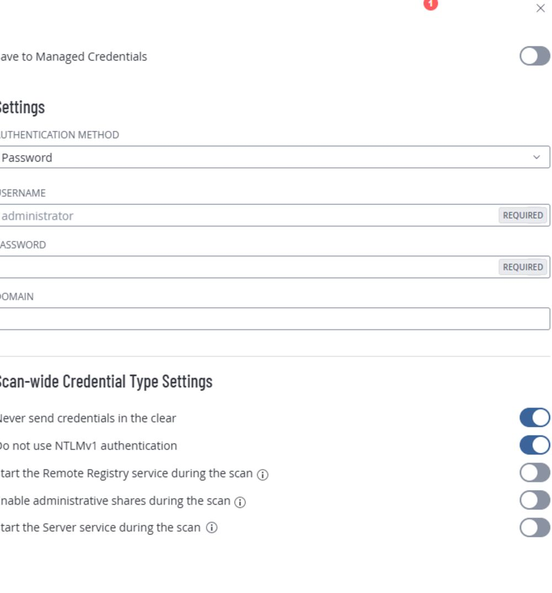
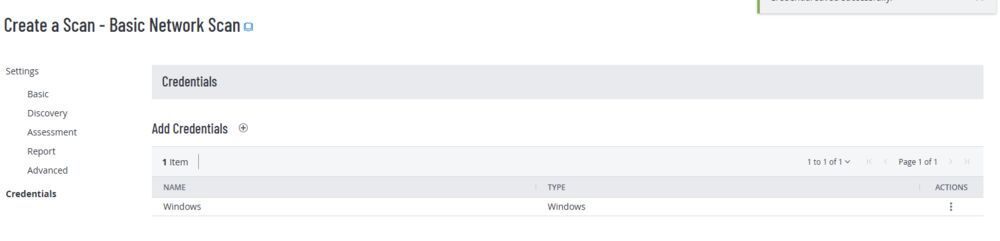
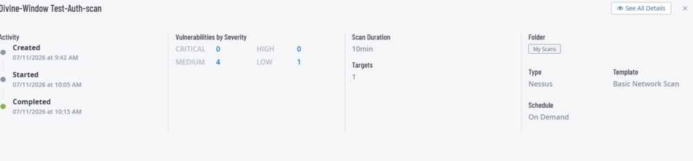

# Project 2: Authenticated Scan on a Windows 11 Pro VM (Azure) Using Tenable

**Tools used:** Tenable, Azure Cloud Environment

## Rationale

An unauthenticated scan only shows what's visible from the outside. To find the deeper, system-level vulnerabilities that an attacker with valid or stolen credentials could exploit, the same VM needs to be scanned again — this time with credentials.

## Goals / Objectives

Perform an authenticated (credentialed) vulnerability scan against the same Windows 11 Pro VM using Tenable, and compare the results and depth against the unauthenticated scan from [Project 1](../01-unauthenticated-scan-windows/README.md).

## Assumptions

- I have access to Azure and Tenable, as well as Tenable's vulnerability management guide.
- I am familiar with VM creation and configuration on Azure.

## Phase 1: VM & Credential Prep

1. Create a Windows 11 Pro VM in Azure.
2. Log into the VM.
3. Disable the Windows Firewall for the Domain, Private, and Public profiles. (If I had created and attached a Network Security Group (NSG) to the VM, I would have made sure to add a rule allowing all inbound traffic from the Tenable Scan Engine by including its IP address in the rule. I used the VM's private IP address because the scanner and VM are in the same network environment.)
4. Prior to running the scan, I ran the following PowerShell command in the VM as an admin to enable remote admin access by modifying the LocalAccountTokenFilterPolicy registry key. This allows a local account (such as the VM's user) to connect remotely with full admin privileges without requiring elevation:

Set-ItemProperty -Path "HKLM:\SOFTWARE\Microsoft\Windows\CurrentVersion\Policies\System" -Name "LocalAccountTokenFilterPolicy" -Value 1 -Type Dword -Force

## Phase 2: Tenable Scan Configuration & Results

1. Log into Tenable.
2. Select a scan type — a Basic Network Scan.
3. Under Basic, configure the scan by giving it a name, choosing the scan type (Internal), and setting the target to the VM's private IP.
4. Under Discovery, select the custom scan type, activate Ping the Remote Host, and activate Use Fast Network Discovery.
5. Under Credentials, click the + icon to add credentials. In the side window, select Host, then Windows, then enter the VM's username and password.
6. Save & Launch.

## Observations

- I first hit an "Invalid Target" error — adding credentials alone wasn't enough; I still needed to enter the VM's private IP address as the target.
- As with the unauthenticated scan, a scan that finishes in just a couple of minutes usually points to a configuration issue — most often the VM firewall, or in this case, incorrect credentials.
- Authenticated scans have high-level access to the VM and perform an in-depth assessment, surfacing deep system vulnerabilities that require elevated access to see — a noticeably different (and larger) set of findings than the unauthenticated scan in Project 1.

---

Back: [Project 1 — Unauthenticated Scan on Windows](../01-unauthenticated-scan-windows/README.md). Portfolio [home](../../README.md). Next: [Project 3 — Unauthenticated Scan on Linux](../03-unauthenticated-scan-linux/README.md)
