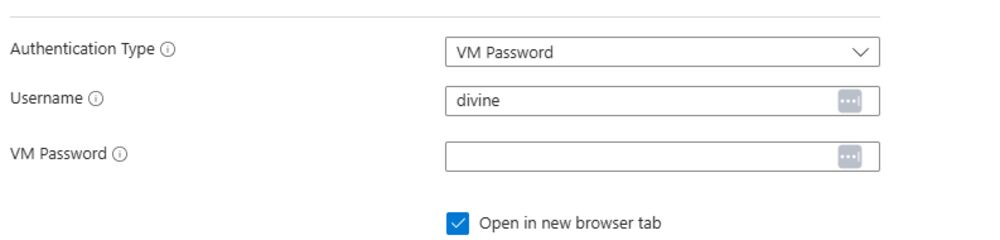
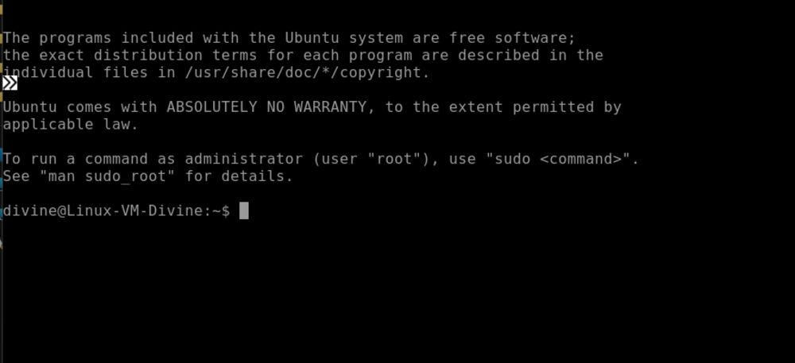
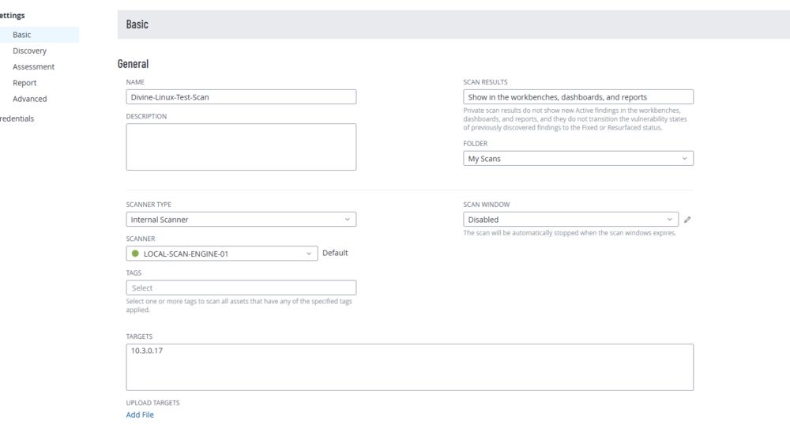
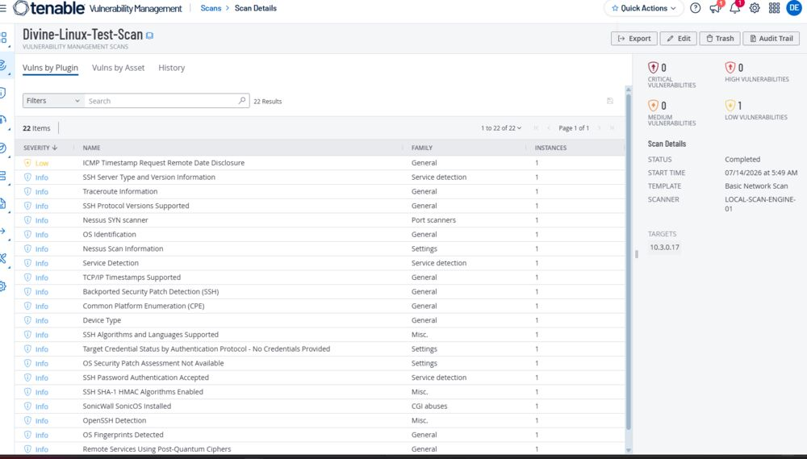

# Project 3: Unauthenticated Scan on a Linux VM (Azure) Using Tenable

**Tools used:** Tenable, Azure Cloud Environment

## Rationale

Enterprise environments rarely run a single operating system. Repeating the unauthenticated scan against a Linux host validates that the same baseline vulnerability-management workflow from Projects 1 and 2 holds up across different OS families.

## Goals / Objectives

Perform an unauthenticated vulnerability scan against a Linux (Ubuntu 24) VM in Azure using Tenable, and compare the findings to the Windows-based scans.

## Assumptions

- I have access to Azure and Tenable, as well as Tenable's vulnerability management guide.
- I am familiar with VM creation and configuration on Azure.

## Phase 1: VM Setup

1. Create a Linux (Ubuntu 24) VM in Azure.
2. Log into the VM.
3. I did not disable firewalls at this stage — I wanted to see how deep an unauthenticated scan would get without that adjustment. (If I had created and attached a Network Security Group (NSG) to the VM, I would have made sure to add a rule allowing all inbound traffic from the Tenable Scan Engine by including its IP address in the rule. I used the VM's private IP address because the scanner and VM are in the same network environment.)

## Phase 2: Tenable Scan Configuration & Results

1. Log into Tenable.
2. Select a scan type — a Basic Network Scan.
3. Under Basic, configure the scan by giving it a name, choosing the scan type (Internal), and setting the target to the VM's private IP.
4. Under Discovery, select the custom scan type, activate Ping the Remote Host, and activate Use Fast Network Discovery. No credentials are added for this scan.
5. Save & Launch.

## Observations

- As with the Windows scans, a scan finishing within just a couple of minutes usually points to a configuration issue rather than a clean host.
- My scan took about 10 minutes to complete. Unauthenticated access is low, so this is a surface-level assessment — the results reported no credentials provided and no OS security patch assessment available, both expected for an unauthenticated run.
- Unauthenticated scans remain useful for identifying externally facing vulnerabilities — the ones visible without any inside access.

---

Back: [Project 2 — Authenticated Scan on Windows](../02-authenticated-scan-windows/README.md). Portfolio [home](../../README.md). Next: [Project 4 — Authenticated Scan on Linux](../04-authenticated-scan-linux/README.md)
