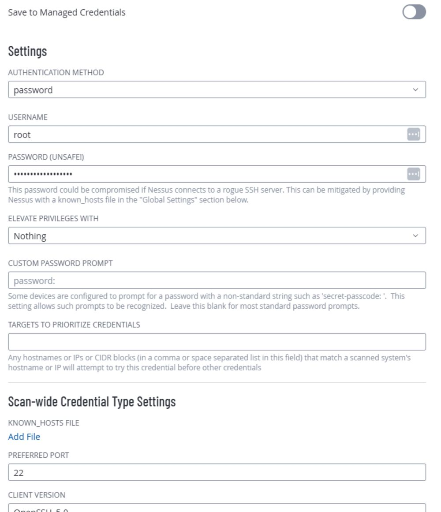
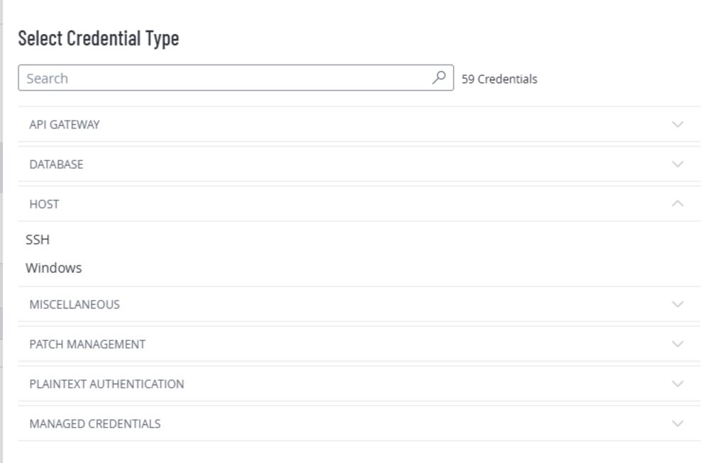
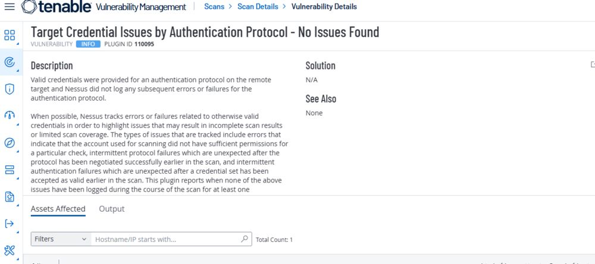

# Project 4: Authenticated Scan on a Linux VM (Azure) Using Tenable

**Tools used:** Tenable, Azure Cloud Environment

## Rationale

Enterprise environments often have devices and computers with a variety of operating systems and configurations. Basic vulnerability scans are sometimes enough to identify common vulnerabilities, but in-depth scans are usually needed to identify serious systemic ones — which is where an authenticated scan comes in, this time on a Linux VM on Azure using Tenable.

## Goals / Objectives

Perform an authenticated vulnerability scan on a Linux VM on Azure using Tenable to identify vulnerabilities found on the host, then prioritize the findings and identify a way to remediate each one.

## Assumptions

- I have access to Azure and Tenable, as well as Tenable's vulnerability management guide.
- I am familiar with VM creation and configuration on Azure.

## Phase 1: VM & Credential Prep

1. Create a Linux (Ubuntu 24) VM in Azure.
2. Log into the VM.
3. I did not disable firewalls at this stage — I wanted to see how deep the scan would go.
4. Prior to running the scan, I set a password for root with `sudo passwd root`, which I then used as the scan credential, and enabled root login over SSH with the command below, so the Tenable Scan Engine could log in as root and perform a deep scan of the VM:

sudo grep -q '^PermitRootLogin' /etc/ssh/sshd_config && sudo sed -i 's/^PermitRootLogin.*/PermitRootLogin yes/' /etc/ssh/sshd_config || echo 'PermitRootLogin yes' | sudo tee -a /etc/ssh/sshd_config > /dev/null && sudo systemctl restart ssh

Disclaimer: this is not an efficient or safe way to configure a scan target. It's a lab exercise meant to illustrate the difference between an authenticated and unauthenticated scan result. In a real work environment, this would be handled differently, through the system administrator. (If I had created and attached a Network Security Group (NSG) to the VM, I would have made sure to add a rule allowing all inbound traffic from the Tenable Scan Engine by including its IP address in the rule. I used the VM's private IP address because the scanner and VM are in the same network environment.)

## Phase 2: Tenable Scan Configuration & Results

1. Log into Tenable.
2. Select a scan type — a Basic Network Scan.
3. Under Basic, configure the scan by giving it a name, choosing the scan type (Internal), and setting the target to the VM's private IP.
4. Under Discovery, select the custom scan type, activate Ping the Remote Host, and activate Use Fast Network Discovery.
5. Under Credentials, add the root credentials configured in Phase 1.
6. Save & Launch.

## Observations

- As before, a scan that completes within just a couple of minutes usually signals a configuration issue — most often the firewall or incorrect credentials.
- Authenticated scans have high-level access to the VM and perform an in-depth assessment, identifying deep system vulnerabilities that require elevated access to see.
- Both scans (using the root credentials and, separately, the original VM login credentials) completed within about 6 minutes and returned the same results — a useful confirmation that either credential set gave the scanner full access.

---

Back: [Project 3 — Unauthenticated Scan on Linux](../03-unauthenticated-scan-linux/README.md). Portfolio [home](../../README.md). Next: [Project 5 — Scan Templates & DISA STIG](../05-scan-template-disa-stig/README.md)
