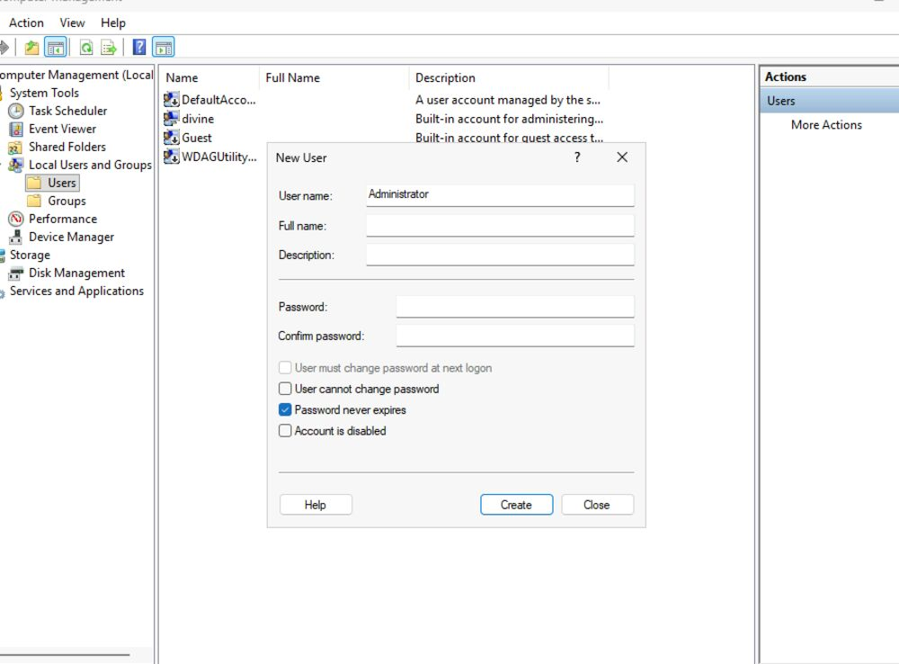
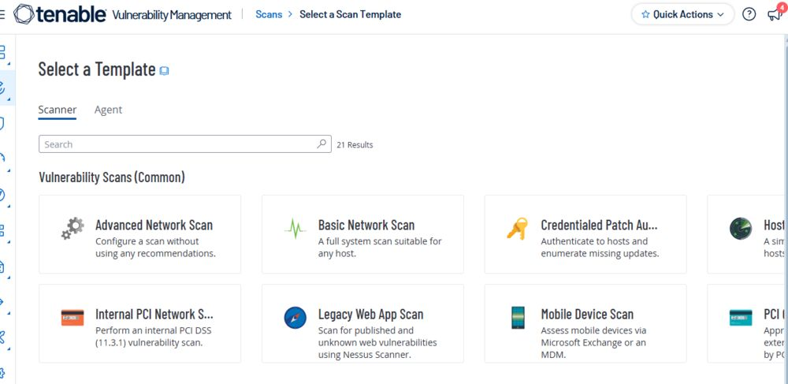
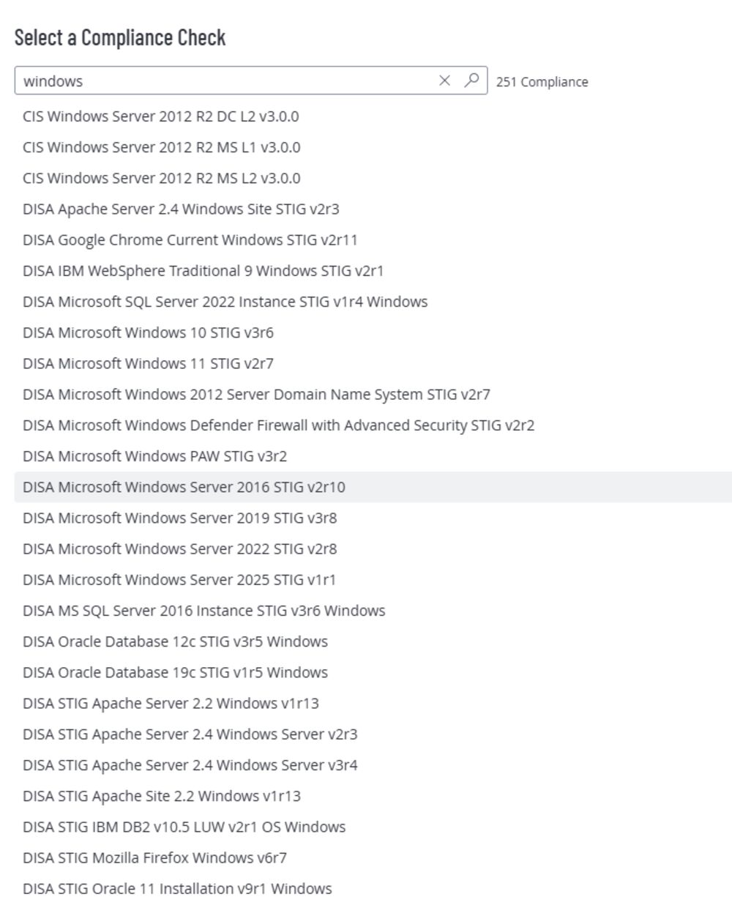
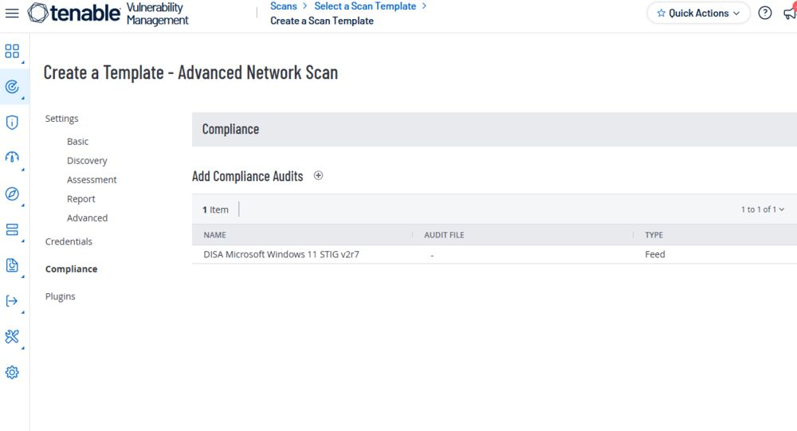
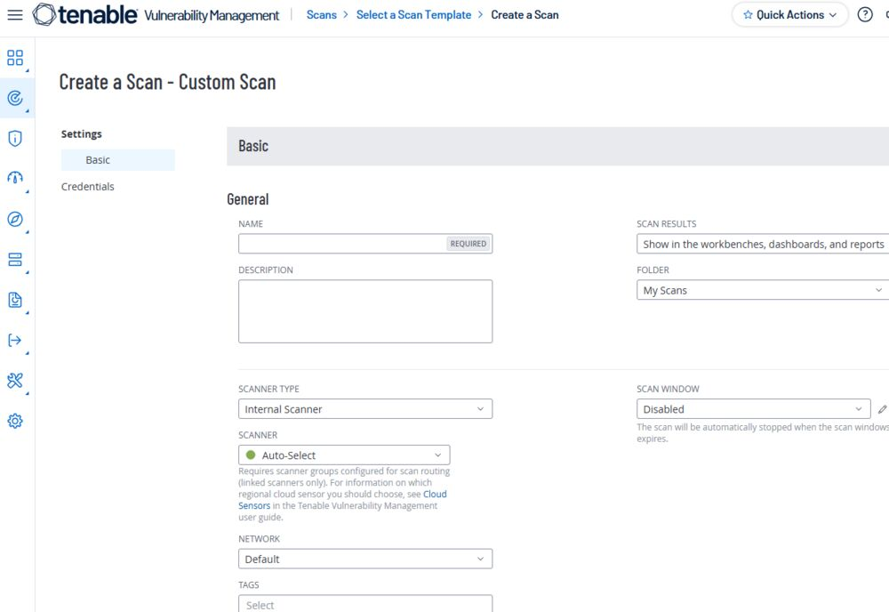
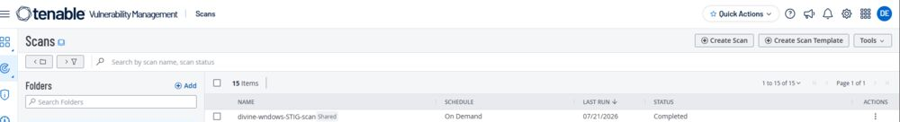

# Project 5: Setting Up a Scan Template & Performing a DISA STIG Scan on Windows 11 (Azure) Using Tenable

**Tools used:** Tenable, Azure Cloud Environment

## Rationale

Projects 1 through 4 involved manually configuring a scan for each individual VM. Imagine having hundreds of VMs to scan — configuring each one by hand wouldn't scale. It's far more efficient to build a pre-configured scan template for the type of scan you want to run repeatedly.

In an enterprise setting, scan templates are frequently used for compliance purposes. Companies are often required to comply with government or industry security regulations, and vulnerability scan templates aren't just used to discover vulnerabilities — they're also used to check compliance against those regulations. One example is the DISA (Defense Information Systems Agency) STIG (Security Technical Implementation Guide) compliance audit, which checks whether a system meets a specific regulatory, industry, or internal standard.

## Goals / Objectives

Create a scan template to perform a DISA STIG compliance audit on a Windows 11 VM in Azure that I've intentionally configured with vulnerabilities the audit should catch, then use the results to identify the remediations needed for the system to have a chance of passing the compliance audit.

## Assumptions

- I have access to Azure and Tenable, as well as Tenable's vulnerability management guide.
- I am familiar with VM creation and configuration on Azure.

## Phase 1: VM Setup & Intentional Vulnerabilities

1. Create a Windows 11 Pro VM in Azure.
2. Log into the VM.
3. Disable the Windows Firewall for the Domain, Private, and Public profiles. (If I had created and attached a Network Security Group (NSG) to the VM, I would have made sure to add a rule allowing all inbound traffic from the Tenable Scan Engine by including its IP address in the rule. I used the VM's private IP address because the scanner and VM are in the same network environment.)
4. Intentionally introduced vulnerabilities on the VM for the scan to discover: created/enabled an administrator account, set a blank password with no expiration, added that administrator account to the Administrators group, and enabled the guest account and added it to the Administrators group without a password.

## Phase 2: Scan Template & DISA STIG Compliance Audit

1. Log into Tenable.
2. Create a scan template with the following settings: scan type Advanced Network Scan; under Basic, name the template (e.g. `___TEMPLATE: Windows 11 STIG scan test-divine`), set the target to the VM's private IP, select the Remote Registry service, enable Administrative Shares, and start the Server service during the scan; under Discovery, select the custom scan type, activate Ping the Remote Host and Use Fast Network Discovery, and set the Network Port Scanner to TCP; under Assessment, select Perform Thorough Test and uncheck Only use credentials provided by user; under Credentials, add the credentials for the administrator account created in Phase 1; under Compliance, add the audit for DISA Microsoft Windows 11 STIG v2r7 (or the current version available); under Plugins, select General, Policy Compliance (Windows Compliance Checks), Settings → Windows, Windows: Microsoft Bulletins, and Windows: User Management.
3. Save the scan template.
4. Create a new scan from the template, enter the credentials, and set the target IP (the VM's private IP).
5. Launch the scan.

## Observations

- I initially ran into an issue where the STIG scan completed within a minute and found no vulnerabilities — unusual, since I had deliberately made the VM vulnerable. After confirming the VM was running, I realized I hadn't disabled the firewall on this VM. Once I disabled it, the STIG scan ran much longer and caught the intended vulnerabilities.
- As with the earlier scans, a scan that finishes too quickly is almost always a configuration issue rather than a clean host — most often the firewall.
- The completed compliance audit returned a series of `WN11-00-xxxxxx` warnings against the DISA Windows 11 STIG baseline, confirming the template correctly evaluated the VM's compliance posture, not just its raw vulnerabilities.

---

Back: [Project 4 — Authenticated Scan on Linux](../04-authenticated-scan-linux/README.md). Portfolio [home](../../README.md). Next: [Project 6 — Agent-Based Monitoring](../06-agent-based-monitoring/README.md)
